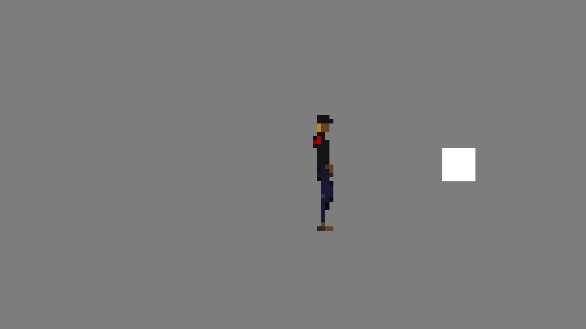

# Rapport d'itération  

## Composition de l'équipe

|  Nom              | Code Permanent | Role               |
|-------------------|----------------|--------------------|
|  Wajih Alaoui     | ALAM05129904   |                    |
|  Tristan Delort   | DELT22019904   |  **Scrum Master**  |
|  Hugo Deniau      | DENH23099907   |                    |
|  Loïs Deniau      | DENL25019903   |                    |
|  Lucien Mocrette  | MORL07049908   |                    |

## Bilan de l'itération précédente

### Évènements

> La remise des projets de mi-trimestre a un peu retardé le developpement.

### Taux de complétion de l'itération  

*Quel est le nombre d'éléments terminés par rapport au nombre total d'éléments prévu pour l'itération?*
> *8 terminés / 9 prévues = 80%*

### Liste des User Stories terminées

- En tant que joueur, je vais rencontrer des usagers ayant un comportement spécial et clé à l'histoire du jeu
  - [ ] Un spécialisation des passager normaux qui permet l'ajout de dialogue et comportements spéciaux
- En tant que joueur, je veux pouvoir discuter avec les usagers en tant que contrôleur de métro
  - [x] Un système de dialogue affiche une ligne de texte en la lisant dans un fichier
  - [x] Le texte s'affiche caractère par caractère (comme avec YarnSpinner par exemple)
- En tant que joueur, je veux que ce jeu se déroulant dans le métro voit des usagers entrer/sortir pour simuler au mieux l'environnement
  - [x] Les usagers apparaissent automatiquement lors de l'appel d'une fonction
  - [x] Les usagers n'apparaissent pas tous au même endroit mais dans des endroits "clés" (équivalents aux portes)
- En tant que joueur, je veux voir les animations de mon personnage qui se déplace à l'écran pour apprécier de jouer avec
  - [x] Le joueur a une animation de Idle
  - [x] Le joueur a une animation de marche
  - [x] Le joueur a une animation d'interaction
  - [x] Les animations sont ajoutées dans Unity

## Rétrospective de l'itération précédente
  
### Bilans des retours et des précédentes actions

*Quels sont les retours faits par l'équipe pendant la rétrospective? Quelles sont les actions qui ont apporté quelque chose ou non?*
> La gestion du sprint et des user story doit être fait par une personne qui verifie la bonne complétion du travail (Scrum Master) en les validant avec Product Owner.

### Actions prises pour la prochaine itération

*Quelles sont les actions décidées par l'équipe pour la prochaine itération ?*
> Élire Tristan en Scrum Master pour avoir une meilleur gestion des User Story et du travail d'équipe.

### Axes d'améliorations

*Quels sont les axes d'améliorations pour les personnes qui ont tenu les rôles de PO, SM et Dev sur la précédente itération?*
> Mieux assigner la difficulté des taches avant de les partager entre les différents développeurs. Mieux communiquer entre nous pour éviter de devoir coder la partie d'un autre, ou de se retrouver bloqué en attendant qu'il finisse.

## Prévisions de l'itération suivante  

### Évènements prévus

*Quels sont les évènements qui vont peut être impacter l'itération? Répertoriez ici les évènements que vous anticipez comme ayant un impact potentiel pour l'itération (absences, changement de cap, difficultés, etc.).*
> Les projets de Moteur de Jeu et de Math & Physique pour l'informatique risque de réduire le temps disponible pour certains.

### Titre des User Stories reportées

*Lister ici les éléments des itérations précédentes qui ont été reportés à l'itération suivante. Ces éléments ont dû être revus et corrigés par le PO.*
> La User Story de l'implémentation des usagers spéciaux est reportée au prochain sprint.

### Titre des nouvelles User Stories

- En tant que joueur, je veux avoir des dialogues interessants et non-redondants avec les usagers.
  - [ ] Des lignes de dialogues sont écrites pour les passagers lambdas
  - [ ] Des lignes de dialogues sont écrites pour les passagers spéciaux
- En tant que joueur, je veux pouvoir valider ou non les titres de transports d'un utilisateur en fonction des règles en vigueure
  - [ ] Un bouton est disponible pour mettre une amende a un usager
  - [ ] Gérer les differents cas : amende / fraudeur, amende / en règle, valider / fraudeur, valider / en règle
- En tant que joueur, je veux que les usagers se déplacent et voir leurs animations dans le jeu pour intéragir avec eux
  - [ ] Les usagers ont une animation de Idle
  - [ ] Les usagers ont une animation de marche
  - [ ] Les usagers ont une animation d'interaction
  - [ ] Les animations sont ajoutées dans Unity
- En tant que joueur, je vais rencontrer des usagers ayant un comportement spécial et clé à l'histoire du jeu
  - [ ] Un spécialisation des passager normaux qui permet l'ajout de dialogue et comportements spéciaux

## Confiance

### Taux de confiance de l'équipe dans l'itération suivante

|           | :(    | :&#124;   | :)    | :D    |
|:---------:|:-----:|:---------:|:-----:|:-----:|
| Wajih     |  *.*  |  *X*      |  *.*  |  *.*  |
| Tristan   |  *.*  |  *.*      |  *X*  |  *.*  |
| Hugo      |  *.*  |  *.*      |  *X*  |  *.*  |
| Loïs      |  *.*  |  *X*      |  *.*  |  *.*  |
| Lucien    |  *.*  |  *.*      |  *X*  |  *.*  |

### Taux de confiance de l'équipe pour la réalisation du projet

*Remplir le tableau sachant que :D est une confiance totale dans le fait de réaliser le projet. Mettre le nombre de votes dans chacune des cases. Expliquer en cas de besoin.*

|           | :(    | :&#124;   | :)    | :D    |
|:---------:|:-----:|:---------:|:-----:|:-----:|
| Wajih     |  *.*  |  *.*      |  *.*  |  *X*  |
| Tristan   |  *.*  |  *.*      |  *X*  |  *.*  |
| Hugo      |  *.*  |  *.*      |  *X*  |  *.*  |
| Loïs      |  *.*  |  *.*      |  *.*  |  *X*  |
| Lucien    |  *.*  |  *.*      |  *.*  |  *X*  |

## Screenshots

|   |   |
|---|---|
| Animations | |
|  |  |
|  |  |
| Interface de controle des usagers| Pièce d'indentité qui change en fonction des usagers |
|  |  |
| Création de passagers avec des informations différentes en fonction du niveau | |
|  |  |